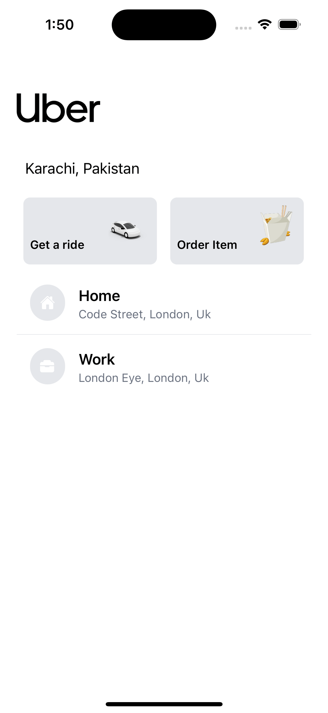
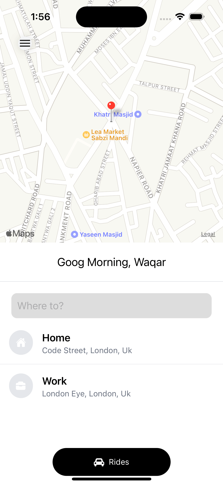
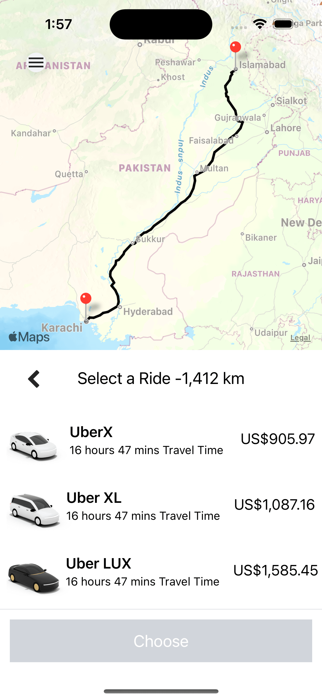

# Uber Clone;

## Using React Native | Expo | Expo Web | Redux | tailwind | React Native Element | React Navigation | Google Place Autocomplate | React Native Map | React Native Map Direction | Distance Matrix API

## Set To make you Own clone.

1. use expo to create the project
   `npx create-expo-app uber-clone`

2. to to the project by
   `cd uber-clone`

3. add the web support
   `npx expo install react-dom react-native-web @expo/webpack-config`

4. start the project by
   `npx expo start`

5. open project add redux
   `yarn add @reduxjs/toolkit redux react-redux`

6. add tailwind class name libray
   `yarn install twrnc`

7. add react native element
   `yarn add react-native-elements`

8. add vector icons
   `yarn add react-native-vector-icons`

9. add safe area for the icons
   `yarn add react-native-safe-area-context`

10. reload the application.

11. add React Navigation
    `npm install @react-navigation/native`

12. add expo react navigation dependies by
    `npx expo install react-native-screens react-native-safe-area-context`

13. add gesture handle by
    `npx expo install react-native-gesture-handler`

14. add stack navigator
    `npm install @react-navigation/stack`

15. add google place autocomplate
    `yarn add react-native-google-places-autocomplete`

16. go to goolge console and go to APIs & service then click Enable Apps and Services

17. then search `Directions API` enable it and then `Places Api`

18. to to credentials add api key .

19. create .env file and save the key there

20. add react native dotenv to project
    `yarn add react-native-dotenv`

21. go to babel.config.js add
    ` plugins: [
  [
    "module:react-native-dotenv",
    {
      moduleName: "@env",
      path: ".env",
    },
  ],
],`

22. Sometime it does not work because of cache so use
    `npx expo start -c`

23. add React native map to the project
    `yarn add react-native-maps`

24. add react native map direction
    `yarn add react-native-maps-directions`

# Preview

| Landing                      | Choose                       | Confirm                      |
| ---------------------------- | ---------------------------- | ---------------------------- |
|  |  |  |
